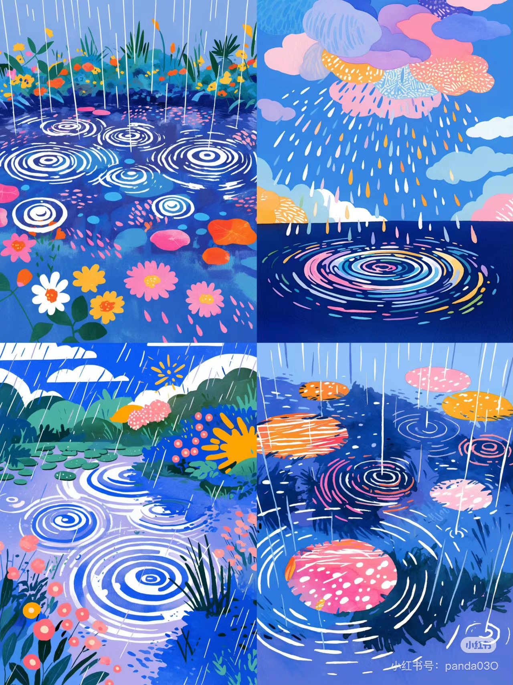
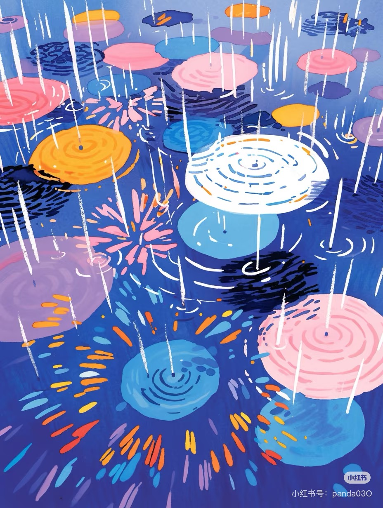

# chli0764_GroupB_majorProject
## Part1
- part1:  
**Instructions for interacting with the work**：
Click the play button and wait for the music to start. The swimming ring will move with the music. Click pause and all pictures will stop. Click the ENTER key on the keyboard and the screen will flash to simulate the effect of thunder.

***
## Part2
- part2:  
**Introduction of the Work**：
1. I selected audio to drive my code.

2. The swimming ring in the image will rotate with the music, and the decorative dots on the swimming ring will also rotate. In our group's works, KK and I focused on the animation of the main object, while others focused on the animation of the background. KK's swimming ring is scaled, while my swimming ring is rotated and moved. Our group's works each ensured differences.

3. Animation inspiration：When I saw this picture, I thought of the scene of listening to music in the summer and watching the swimming rings floating in the swimming pool. This gave me the inspiration for the code.

4.Technical Description:The code was first modified based on the content of week 11, the second modification applied the knowledge learned on bilibili, and the third modification was based on the content on coding train.

[bilibili](https://www.bilibili.com/video/BV1tu411g7KN/?share_source=copy_web&vd_source=fe2dd70155d2f59a9b54faf6e0b5f003)

[coding train](https://youtu.be/Pn1g1wjxl_0?si=9QlBKQwosmoBvxFS)
